# Milestone 1: Experiment & Evaluation Analysis

This document provides a comprehensive chronological analysis of the experiments, configurations, and results for Milestone 1 (**M1: Offline Vision $\rightarrow$ Text Perception Spine**). It details how the project progressed from a small-scale, memory-constrained MLP prototype to a scaled-up, feature-cached model, culminating in the validation of the frozen V-JEPA 2 encoder.

---

## 1. Experiment Timeline & Results Summary

The table below traces the chronological trajectory of the M1 experiments. All experiments used the frozen **V-JEPA 2 ViT-L** encoder (`facebook/vjepa2-vitl-fpc64-256`, 1024-dim, 64 frames, 256px resolution) as the vision spine.

| Run ID / Setup | Predictor / Spine | Text Target | Dataset / Scale | Batch Size | Steps | Loss Function | Feature Cache | Eval Results (R@1 / R@5 / R@10 / MedR) | Key Findings / Outcome |
| :--- | :--- | :--- | :--- | :--- | :--- | :--- | :--- | :--- | :--- |
| **Run 1: Spine A Baseline** | SwiGLU MLP (Attention-pooled) | Frozen MiniLM (384-dim) | MSR-VTT (7k clips) | 8 | 5,000 | Bidirectional InfoNCE | **No** | **V$\rightarrow$T:** 16.8 / 39.9 / 53.7 / 9.0 **T$\rightarrow$V:** 16.8 / 43.1 / 56.7 / 8.0 | **Gate Aborted.** First baseline showing stable training (no collapse) but underperformed the SigLIP2 32.5 baseline. |
| **Run 2: Spine B (No Queue)** | Llama-3.2-1B Last 8 Layers (490M) | EmbeddingGemma (1536-dim) | MSR-VTT (7k clips) | 8 | 5,000 | Bidirectional InfoNCE | **No** | **V$\rightarrow$T:** 13.9 / 35.8 / 51.2 / 10.0 **T$\rightarrow$V:** 16.1 / 39.8 / 54.8 / 8.0 | **Severe Overfitting.** High training accuracy (~92%) but lower eval R@1. Predictor was too heavy for small batch size & data. |
| **Run 3: Spine B (With Queue)** | Llama-3.2-1B Last 8 Layers (490M) | EmbeddingGemma (1536-dim) | MSR-VTT (7k clips) | 9 | 5,000 | Bidirectional InfoNCE | **No** | **V$\rightarrow$T:** 16.2 / 39.9 / 56.2 / 9.0 **T$\rightarrow$V:** 15.8 / 41.3 / 57.8 / 8.0 | **Stale Queue Collapse.** Adding MoCo queue (2048) stabilized representation by freezing the text anchor, but tied/underperformed Run 1. |
| **Run 4: SigLIP Trial** | SwiGLU MLP (Attention-pooled) | Frozen MiniLM (384-dim) | MSR-VTT (7k clips) | 8 | 8,000 | Pairwise SigLIP | **No** | **V$\rightarrow$T:** 6.3 / 23.0 / 34.9 / 22.0 **T$\rightarrow$V:** 8.3 / 24.4 / 36.4 / 19.0 | **Regression.** SigLIP was poorly suited for small batch size 8 because it optimizes per-pair thresholds rather than ranking. |
| **Run 5: Scale Run** | SwiGLU MLP (Attention-pooled) | Frozen MiniLM (384-dim) | MSR-VTT + VATEX (~50k clips) | 256 | 8,000 | Bidirectional InfoNCE | **Yes (bf16)** | **V$\rightarrow$T:** **22.5** / 48.7 / 61.4 / 6.0 **T$\rightarrow$V:** **22.6** / 49.0 / 62.1 / 6.0 | **Breakthrough Success.** Vindicated the V-JEPA encoder. Proved that data scale and large batch size were the real performance bottlenecks. |

---

## 2. Retrieval Performance Evolution (V$\rightarrow$T R@1)

The following diagram visualizes the performance of different runs. It highlights how scaling the data and negatives (batch size) using the feature cache was the key driver of improvement:

```mermaid
gantt
    title Retrieval Performance (Video to Text R@1 %)
    dateFormat  X
    axisFormat %s
    
    section Baseline (MLP)
    Run 1 (MLP, Batch 8, 7k Clips) : 0, 16.8
    
    section Heavy Predictor (Llama)
    Run 2 (Llama, No Queue, Batch 8, 7k Clips) : 0, 13.9
    Run 3 (Llama, 2048 Queue, Batch 9, 7k Clips) : 0, 16.2
    
    section SigLIP Loss
    Run 4 (SigLIP, Batch 8, 7k Clips) : 0, 6.3
    
    section Scale (Cached Features)
    Run 5 (MLP, Batch 256, 50k Clips) : 0, 22.5
```

---

## 3. Key Architectural & Engineering Decisions

### 1. The Blocker: Worker OOM Kills & Slow Training
During local/server training, decoding videos in real-time and feeding them through the frozen V-JEPA 2 ViT-L encoder caused major issues:
* **Memory Exhaustion (OOM)**: The frozen encoder consumed ~26 GB of RAM/VRAM. When spawning multiple DataLoader workers, the memory usage multiplied, leading to Python process crashes and container OOM kills.
* **Severe Latency**: Steps took up to **2.6 minutes/step** (equivalent to ~12 days for a full training run).
* **The Solution (Feature Caching)**: We decoupled feature extraction from training.
  - Features were extracted once in `bf16` precision (64 frames/256px resolution) using `scripts/extract_features.py`.
  - A custom dataset (`data/cached_feature_dataset.py`) read the pre-computed tensors directly from disk.
  - Training completely skipped instantiating or loading the heavy `VisionEncoder` model.
  - **Result**: Step time crashed to **seconds/step** (training completed in ~1–2 hours total), RAM/VRAM issues disappeared, and we unlocked large-batch training.

### 2. Large Batches vs. Queue Size (InfoNCE Negatives)
InfoNCE loss is highly sensitive to the number of negative samples in contrastive learning.
* At a batch size of 8, the model has only 7 negative captions per video. This weak training signal led to severe overfitting on Run 2 (Spine B).
* Re-running Spine B with a MoCo queue of size 2048 provided more negatives and raised the performance (13.9% $\rightarrow$ 16.2% R@1). However, the queue was fragile due to **stale queue collapse** (fast-moving gradients/no EMA target for vision). Freezing the text anchor prevented complete collapse.
* Decoupling the encoder via feature caching allowed scaling the batch size to **256**, providing 255 fresh, in-batch negatives per step. This drove the performance to a peak of **22.5% R@1**.

### 3. The Failure of SigLIP at Small Batch Sizes
* SigLIP optimizes pairwise sigmoid thresholds. At batch size 8, this thresholding proved much weaker than InfoNCE's ranking mechanism, dropping the R@1 to a low of **6.30%** (a regression of over 10 points compared to MLP InfoNCE).
* Even though the M1 Gate initially printed "PASS" due to a configuration mismatch (the baseline in `configs/m1_scale.yaml` was set to `0.00`), it was recognized as a regression. The decision was made to revert to **InfoNCE** as the core loss function for retrieval.

---

## 4. Ground-Truth Verdict & Takeaways for Milestone 2

> [!IMPORTANT]
> **The Encoder is Vindicated**
> The fact that keeping the vision encoder fixed and scaling the dataset (from 7k to 50k) and batch size (from 8 to 256) increased retrieval R@1 from **16.8% to 22.5%** proved that the bottleneck was never encoder quality. Rather, the system needed data scale and negatives. This is consistent with VL-JEPA (which achieves 40.0% R@1 only after 3.3B samples at a batch size of 24k). 
> **Decision**: Keep the V-JEPA 2 ViT-L vision encoder frozen and do not upgrade or switch it.

### Strategic Lessons for M2 (Audio-Visual Congruency Core):
1. **Never Rely on InfoNCE Negatives for Anti-Collapse in M2**: M2 has no frozen anchors (both audio and vision features are moving latents). Cross-modal contrastive queues will collapse without stable anchors. M2 must use **structural anti-collapse** like **SIGReg** (LeJEPA, 2511.08544) or **distillation-based masking** (EMA target + stop-gradient).
2. **Replicate the Cache Pattern**: Extract and cache features for the audio encoder (Whisper-medium for speech, Audio-JEPA ViT-B for ambient sound) once to disk to keep batch training light, fast, and OOM-free on the cluster.
3. **Relative Gates**: Avoid hard comparisons against web-scale models like SigLIP2. Build gating metrics based on relative improvement against chance, baseline retrieval, and qualitative binding check cases.
